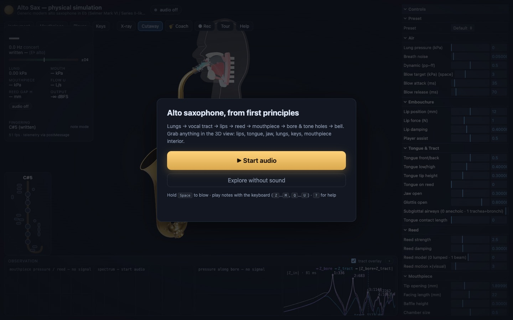
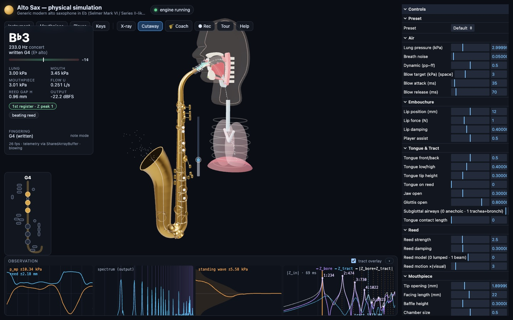
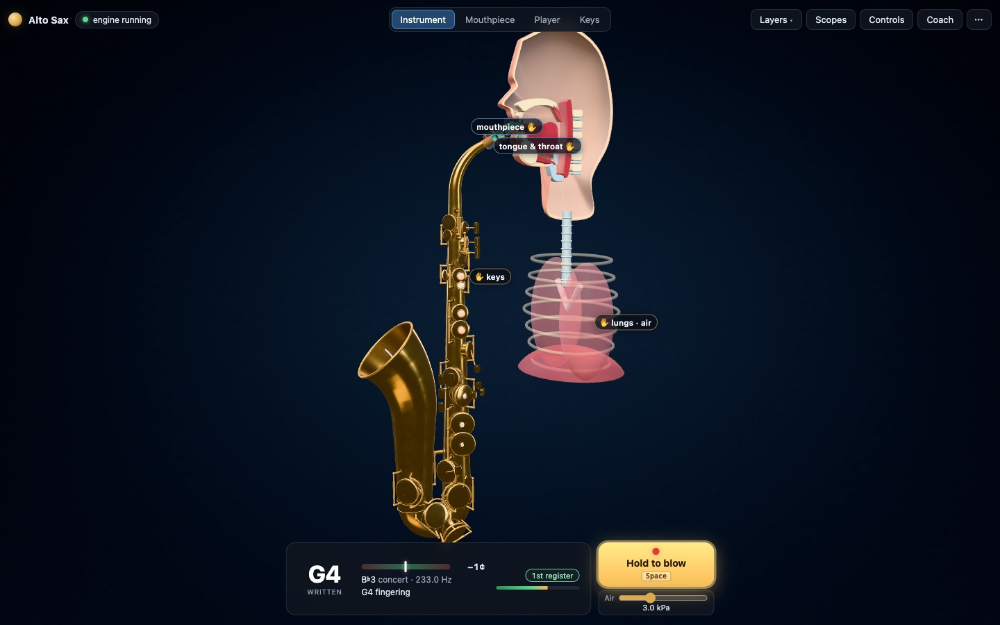
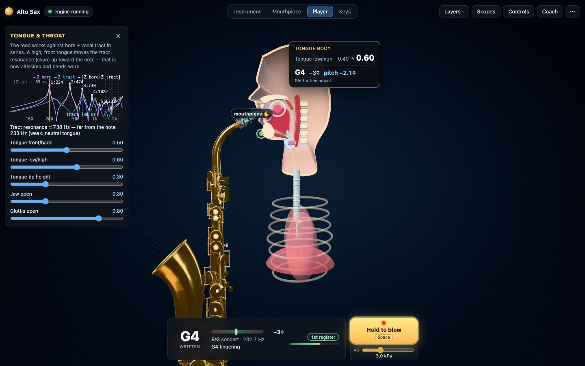

# UX review & redesign — "the 3D model is the instrument"

Reviewer: UX / interaction design. Date: 2026-10-07. Method: the app driven in headless Chrome
(puppeteer-core, SwiftShader) at 1440×900, 1280×720 and 390×844 (touch): first load, Start
audio, first-run tour, playing a note, hovering / dragging the tongue, lips, lungs, a mouthpiece
handle and a key, and every camera preset. Screenshots: `docs/ux/before_*.jpg` (current UI) and
`docs/ux/after_*.jpg` (redesign).

## 1. What a first-time user sees today



1. A start card on top of a dimmed screen that is already full of chrome: a parameter panel with
   ~30 sliders down the whole right edge, a 4-plot "Observation" strip along the bottom, a
   readout card and a fingering chart on the left, and two rows of 11 buttons on top.
2. After **Start audio**, a 7-step tour opens (step 1 is a paragraph about MIDI and the lung
   handle) — before the user has heard anything ([before_1440_02_after_start](ux/before_1440_02_after_start.jpg)).
3. Then the main screen ([before_1440_04_playing](ux/before_1440_04_playing.jpg)): the saxophone
   and the player — the thing the product is about — occupy roughly a quarter of the window,
   pushed into a gap between four floating panels. Nothing on the model says "grab me" except a
   few small coloured dots.



## 2. Problems, ranked by impact

| # | Problem | Evidence | Impact |
|---|---|---|---|
| 1 | **Information overload / no hierarchy.** Everything is open at once: 30+ sliders, 4 live plots, 6 pressure readouts, chips, fingering chart, perf line, 11 top buttons. Five regions compete; the 3D view is the *background* rather than the subject. | `before_1440_04_playing`, `before_1280_04_playing` (at 1280×720 the model is squeezed into ~600×450 px) | Very high — the primary task (grab a part, listen) is visually the least prominent thing. |
| 2 | **Draggable parts are not discoverable.** Handles are 2–3 mm spheres, ~6–10 px on screen in the Instrument view; lips, tongue, reed and lungs have no handle or affordance at all until hovered. The tour text has to explain "the pink handle", "the violet handle", "the green chin handle". | `before_cam_full`, `before_cam_player` | Very high — the core interaction is hidden behind colour-coded jargon. |
| 3 | **Weak drag feedback.** While dragging, the only feedback is a small tooltip with every param of the part (`Tongue body (drag ↔ front/back, ↕ low/high) — Tongue front/back: 0.50 · Tongue low/high: 1.00`) and a "what changed" line in the far-left card, which often names the wrong param (the first one emitted, e.g. *Tongue front/back 0.50 → 0.50* while tongue height went 0.40 → 1.00). The effect on the sound (cents, note) is 600 px away from the cursor. | `before_drag_tongue`, `before_drag_baffle` | High — cause → effect is the point of the app. |
| 4 | **Chrome collides with itself.** At 1440×900 the readout card covers the *Instrument / Mouthpiece / Player* camera buttons (the top bar wraps under it). The tooltip and 3D airway labels cover the tongue being dragged. On a phone, the panel, the readout card and the fingering chart overlap each other and the model. | `before_1440_*` (top left), `before_drag_tongue`, `before_phone_04_playing` | High — controls are literally unreachable at common sizes. |
| 5 | **Small hit targets + orbit conflicts.** Handles must be hit exactly (ray vs a 2 mm sphere); miss by a few px and the camera orbits instead. Orbit controls receive the pointer-down before the picker disables them. No touch-sized targets. | `before_cam_full`, `before_phone_*` | High on touch / trackpad, medium with a mouse. |
| 6 | **Lung drag fights the blow envelope.** While a note is held (auto-blow) the lung handle can be dragged but the envelope immediately writes the pressure back (3.0 → 3.0 kPa in `before_drag_lungs`). | `before_drag_lungs` | Medium — a "broken" control at exactly the moment a user tries it. |
| 7 | **Camera framing ignores the space.** The projection is shifted by a fixed 160×85 px to dodge the panels: the Keys view is cut off at the top, the Player view cuts the sax, the Instrument view leaves the model small. | `before_cam_keys`, `before_cam_player`, `before_cam_full` | Medium. |
| 8 | **Too much text, too technical, too early.** The airway labels ("VOCAL-TRACT RESONANCE ≈ 521 Hz · 9 MPa·s/m³ · note 232 Hz (+1397¢) · weak (neutral tongue)") appear automatically in the Player view, 7 tour steps, chips such as "Z peak 1", µs/block perf line. Great for experts — overwhelming as a default. | `before_hover_tongue` | Medium. |
| 9 | **Readability.** Many 9.5–11 px labels; lil-gui values are clipped (`0.40000`, `2.99999`); the cents bar is a 6 px strip. | all | Medium-low. |
| 10 | **Inconsistency.** Some parts have handles (tongue, jaw, glottis, lungs, mouthpiece), some are grabbed by the mesh (lips, reed, tongue body); handle colours carry meaning that is only in the docs; three different ways to open help (Tour, Help, `?`). | — | Low-medium. |

What works and must be kept: the two-way sync between 3D drags, panel and engine; the camera
presets; keyboard play; the physics-rich observation tools (they are the depth of the product —
they just should not all be the *first* layer); the coach as a separate mode.

## 3. Redesign — progressive disclosure

Guiding principle: **layer 0 is the instrument**. Everything else is one deliberate click away,
and the app shows the *relevant* detail when the user touches a part.

```
┌──────────────────────────────────────────────────────────────────────────────────────┐
│ ● Alto Sax  ·live      [Instrument|Mouthpiece|Player|Keys]  Layers▾   Scopes Controls Coach ⋯ │  ← quiet top bar
│                                                                                      │
│  ┌ TONGUE & TRACT ───×┐                                                             │
│  │ |Z| + tract mini  │            ( full-screen 3D view )                          │
│  │ ▬▬▬○▬ front/back  │                   ◌ tongue  ← soft pulsing grab-ring + tag    │
│  │ ▬▬○▬▬ low/high    │                 ┌──────────────────────┐                     │
│  │ tract ≈ 1170 Hz   │                 │ TONGUE               │  ← drag readout       │
│  └───────────────────┘                 │ low/high  0.40→0.72  │    next to cursor     │
│   context card: appears                │ ♪ G4  −18¢ (Δ −22¢)  │                     │
│   when a part is grabbed               └──────────────────────┘                     │
│                                                                                      │
│               ┌──────────────────────────────────────────────┐                      │
│               │  G4  ▏───●──▕ −4¢   B♭3 233 Hz · 1st reg  ▮▮▮▯ │ [ ◉ Hold to blow ]   │  ← now playing + primary action
│               └──────────────────────────────────────────────┘                      │
└──────────────────────────────────────────────────────────────────────────────────────┘
   Scopes   → bottom drawer (scope, spectrum, standing wave, impedance + tract overlay)
   Controls → right drawer (the full lil-gui panel: every param, presets, MIDI & vibrato,
              keyboard play, view, presets & export incl. WAV/CSV)
   ⋯        → Record WAV · Tour · Help & shortcuts
   Layers   → X-ray · Cutaway · Air flow · Grab hints · Airway readouts
```

Concretely:

1. **Full-bleed 3D.** No panels open by default; the camera's view offset follows what is
   actually open (none → centred; drawer open → the model is re-centred in the remaining space).
   Presets re-framed for the full window.
2. **One "now playing" readout + one primary action** at the bottom centre: written note (large),
   a legible cents meter, concert pitch / Hz, register, loudness bar, recognised fingering, and a
   **Hold to blow** button (mouse / touch / Space). The full numbers (pressures, flow, gap, perf)
   move into the Scopes drawer header.
3. **Drawers, closed by default, remembered** (`localStorage`, try/catch): *Controls* (right) and
   *Scopes* (bottom); `aria-expanded`, focusable, Esc closes the focused drawer, bottom sheets on
   phones.
4. **Self-evident grab points.** Every grabbable part gets a soft halo that pulses gently until the
   user has made their first drag (*grab hints*, togglable in Layers; no motion with
   `prefers-reduced-motion`), small tags ("tongue", "lips", "lungs", "jaw", …) while hints are on,
   `grab` / `grabbing` cursors, a short hover tag ("Tongue · drag ↕ ↔"), and an **active state**
   (handle grows and brightens) while dragging.
5. **Generous hit targets.** A screen-space fallback picks the nearest handle within 22 px
   (34 px for touch) when the ray misses, so small handles are easy to catch at any zoom.
6. **No orbit fights.** The picker handles pointer-down in the capture phase and stops it
   reaching OrbitControls when a part is hit; empty space orbits as before. **Shift while
   dragging = fine adjustment** (¼ speed).
7. **Drag readout near the cursor.** One large, legible card: part name, the param(s) the drag
   is actually changing (start → now), the note and the pitch change in cents since the grab.
8. **Context card.** Grabbing a part (or choosing its camera preset) opens a compact card with
   only the relevant detail: tongue / jaw / glottis → tract-resonance mini impedance plot + those
   sliders; lips → reed-motion scope + embouchure sliders; lungs → scope + air sliders (incl. the
   blow target); mouthpiece / reed → spectrum + mouthpiece & reed sliders; keys → fingering chart +
   bore impedance. Closable; reopens on the next grab.
9. **Lung drag while blowing** moves the blow target (the envelope then follows the hand) instead
   of being overwritten.
10. **Tour: 4 steps** — *Blow*, *Grab the tongue*, *Lips & mouthpiece*, *Keys & everything else*.
    Altissimo and the series-impedance explanation move to Help (and docs/ALTISSIMO.md).
11. **Quieter defaults.** Airway readout labels off by default (Layers → Airway readouts); the
    tongue context card shows the tract resonance in plain words instead.

## 4. What was built

| Area | Change | Files |
|---|---|---|
| Layout | Full-bleed 3D; quiet top bar (brand + status · camera segmented control · Layers ▾ · Scopes · Controls · Coach · ⋯); the projection centre follows what is open (`SceneApp.setViewInsets`) | `index.html`, `style.css`, `main.ts`, `SceneApp.ts` (camera only) |
| Now playing | Bottom-centre bar: written note (large), cents meter, concert pitch / Hz, fingering, register chip, level; **Hold to blow** button (mouse / touch / Enter, same as Space) with a docked **Air** (blow-pressure) slider | `index.html`, `main.ts`, `ui/keyboard.ts` (`blow()`) |
| Drawers | *Controls* (right; the full lil-gui panel incl. presets, MIDI, recording, render quality) and *Scopes* (bottom; 4 plots + tract overlay + pressure/flow numbers + perf) — closed by default, remembered in `localStorage` (`saxsim.ui.v1`), `aria-expanded`, Esc closes, <kbd>Shift</kbd>+<kbd>P</kbd> / <kbd>Shift</kbd>+<kbd>S</kbd>; bottom sheets on phones | `main.ts`, `style.css`, `ui/panel.ts` |
| Grab affordances | Breathing halo on handles not yet grabbed; ✋ tags (tongue, lips, jaw, lungs, keys; detail tags only in close-ups) that retire once a part has been dragged; handles never smaller than 6 px on screen; `grab`/`grabbing` cursors; short hover tag (*Tongue body · drag ↔ front/back, ↕ low/high*); active (enlarged) handle while dragging | `scene/handles.ts`, `scene/interaction.ts`, `ui/grabHints.ts` |
| Drag gain / axis lock / declutter | See §6 | `scene/interaction.ts`, `scene/handles.ts`, `ui/clusters.ts`, handle ranges in `player.ts` / `mouthpiece.ts` |
| Hit targets & orbit | Screen-space snap to the nearest handle within 22 px (34 px touch); picking in the capture phase stops OrbitControls from ever seeing a pointer-down that lands on a part; <kbd>Shift</kbd> while dragging = ¼-speed fine adjust | `scene/interaction.ts` |
| Drag readout | Large card beside the cursor: part, the params actually changing (start → now), the written note, cents, and the pitch change since the grab | `main.ts` (`interaction.readout`) |
| Context card | Opens on grab or camera preset: tract → impedance + tract overlay & plain-words tract resonance; lips → scope; lungs → scope + blow target; mouthpiece/reed → spectrum; keys → fingering chart + bore impedance; with that part's sliders | `ui/context.ts` |
| Lungs | The pressure gauge beside the chest only appears while the lungs are hovered / dragged (the lungs are the grab target); a lung drag while blowing moves the blow target instead of being overwritten | `main.ts`, `ui/keyboard.ts` (`setBlowTarget`) |
| Tour | 4 steps (*Blow · Grab the tongue · Lips & mouthpiece · Keys — and everything else*), placed where it does not cover the model; altissimo moved to Help | `ui/tour.ts`, `index.html` |
| Quieter defaults | Airway readout labels off by default (Layers); "what changed" names the param that moved most (bug fix) | `main.ts` |
| Camera | *Instrument* framed tighter; *Keys* from the player's right-front, whole key system centred; reduced motion → presets jump | `SceneApp.ts` |
| Accessibility | Focus rings, keyboard-operable menus (↑↓ / Esc), dialog roles, `prefers-reduced-motion`, higher-contrast muted text; only text fields block keyboard play (a focused checkbox / slider no longer swallows note keys) | `style.css`, `main.ts`, `ui/keyboard.ts` |

Other fixes found on the way: lil-gui 0.21 uses `.lil-root`, so the old `.lil-gui.root` styles
never applied; the impedance plot stayed blank after its canvas was resized until the next data
change.

## 5. Before / after

Screenshots: `docs/ux/before_*.jpg` (old UI, old render) and `docs/ux/after_*.jpg` (new UI, the
artist's final render at the *low* tier — headless SwiftShader cannot run GTAO / bloom at speed).

| | Before | After |
|---|---|---|
| First load | [before_1440_01_firstload](ux/before_1440_01_firstload.jpg) | [after_1440_01_firstload](ux/after_1440_01_firstload.jpg) |
| First-run tour | [before_1440_02_after_start](ux/before_1440_02_after_start.jpg) | [after_1440_02_after_start](ux/after_1440_02_after_start.jpg) |
| Playing a note | [before_1440_04_playing](ux/before_1440_04_playing.jpg) | [after_1440_04_playing](ux/after_1440_04_playing.jpg) |
| 1280×720 | [before_1280_04_playing](ux/before_1280_04_playing.jpg) | [after_1280_04_playing](ux/after_1280_04_playing.jpg) |
| Phone 390×844 | [before_phone_04_playing](ux/before_phone_04_playing.jpg) | [after_phone_04_playing](ux/after_phone_04_playing.jpg) |
| Hover tongue | [before_hover_tongue](ux/before_hover_tongue.jpg) | [after_hover_tongue](ux/after_hover_tongue.jpg) |
| Drag tongue | [before_drag_tongue](ux/before_drag_tongue.jpg) | [after_drag_tongue](ux/after_drag_tongue.jpg) |
| Drag lungs (while blowing) | [before_drag_lungs](ux/before_drag_lungs.jpg) | [after_drag_lungs](ux/after_drag_lungs.jpg) |
| Drag lip | [before_drag_lip](ux/before_drag_lip.jpg) | [after_drag_lip](ux/after_drag_lip.jpg) |
| Mouthpiece view / drag baffle | [before_cam_mouthpiece](ux/before_cam_mouthpiece.jpg), [before_drag_baffle](ux/before_drag_baffle.jpg) | [after_cam_mouthpiece](ux/after_cam_mouthpiece.jpg), [after_drag_baffle](ux/after_drag_baffle.jpg) |
| Keys view / key click | [before_cam_keys](ux/before_cam_keys.jpg), [before_hover_key](ux/before_hover_key.jpg) | [after_cam_keys](ux/after_cam_keys.jpg), [after_click_key_context](ux/after_click_key_context.jpg) |
| Player / Instrument views | [before_cam_player](ux/before_cam_player.jpg), [before_cam_full](ux/before_cam_full.jpg) | [after_cam_player](ux/after_cam_player.jpg), [after_cam_full](ux/after_cam_full.jpg) |
| Drawers & menus (new) | — | [scopes](ux/after_1440_05_scopes_open.jpg), [controls](ux/after_1440_06_controls_open.jpg), [layers](ux/after_1440_07_layers_menu.jpg), [phone controls](ux/after_phone_06_controls_open.jpg) |




## 6. Follow-up round (approved recommendations 1–3)

| | Problem | Fix |
|---|---|---|
| 1 | **Drag sensitivity followed the zoom.** The tongue's full range was ~60 px in the Player view (an 18 px drag moved tongue height 1.00 → 0.46). | **Screen-space drag gain** (`scene/interaction.ts` `applyGain`, ranges declared per handle in `player.ts` / `mouthpiece.ts` via `planarDrag(…, { ranges })` / `axisDrag(…, range)`): the pointer motion is scaled per value axis so that a part's full range spans 200–250 px on screen at any camera distance. This applies to every part: tongue, tip, jaw, glottis, lungs, lips, the mouthpiece handles and the reed. If a part's natural on-screen size is already 200–250 px the drag stays 1:1. Shift still gives ¼ speed. Handles are grabbed at their centre, and the tongue body is now relative to its value at the grab, so grabbing never makes the value jump. Measured: the same 40 px drag gives Δ0.197 in the Player view and Δ0.193 zoomed in 1.8×. |
| 2 | **The lower lip changed two settings at once.** | **Axis lock**: the lips commit to one axis after 6 px of motion, and switch only on a new grab. *Along the mouthpiece* = take-in (lip position); *toward the reed* = lip force (lower lip) or firmness (upper lip). Nothing moves until the axis is decided, and the drag card says which axis is active ([after_drag_lip](ux/after_drag_lip.jpg)). The **tongue stays 2-D** on purpose: front/back × low/high is one vowel-space gesture for players, and both values are always visible in the card and the context sliders. The tongue tip also stays 2-D, because "drop it on the reed" is a positional gesture. |
| 3 | **Mouthpiece handles bunched at the mouth in the Instrument view.** | **Declutter rule** (`ui/clusters.ts`): a handle cluster whose handles sit < 24 px apart on screen collapses (not drawn, not pickable; it expands again at ≥ 27 px). It is replaced by one clickable tag that flies the camera to that cluster's view: **mouthpiece ✋** → Mouthpiece, **tongue & throat ✋** → Player. A cluster never collapses in its own view. The parts' meshes (lips, tongue, jaw bone, reed, lungs) stay grabbable, and the other tags avoid the cluster tags ([after_1440_04_playing](ux/after_1440_04_playing.jpg), [after_cam_player](ux/after_cam_player.jpg)). |

New e2e checks: drag-distance → value consistency at two zoom levels, lower-lip axis lock (exactly
one of lip position / force changes, and the card says which), mouthpiece cluster collapsed in the
Instrument view and expanded in the Mouthpiece view.

## 7. Still recommended

1. A real 3D affordance for air: drag the diaphragm / rib cage, with the gauge as feedback only.
2. Usability-test the defaults with 3–5 first-time users (do they find the Scopes / Controls
   drawers unprompted? is "written" pitch the right big number for non-players? is the 200–250 px
   range comfortable on a trackpad?).
3. On very small screens even the Player view packs the head handles below 24 px. They are kept
   because it is their own view; an automatic close-up on grab would help there.
